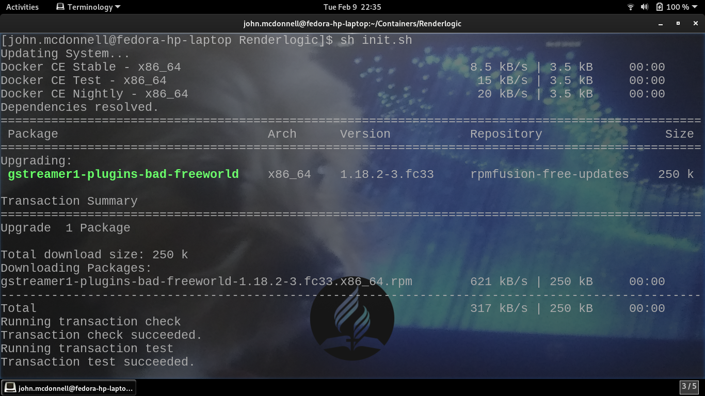
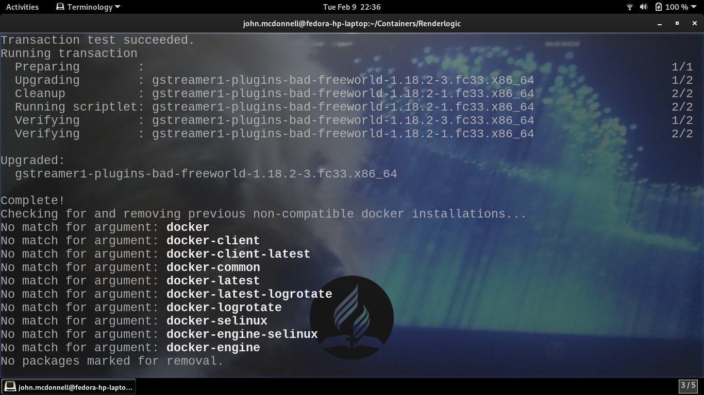
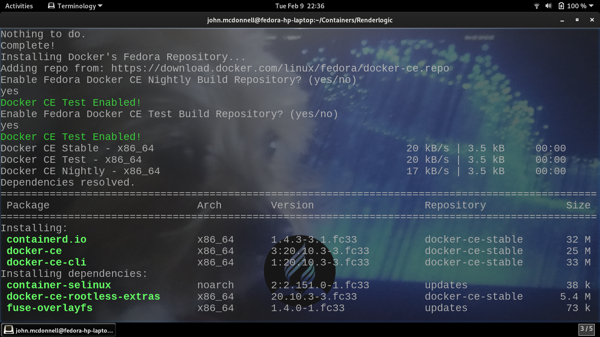
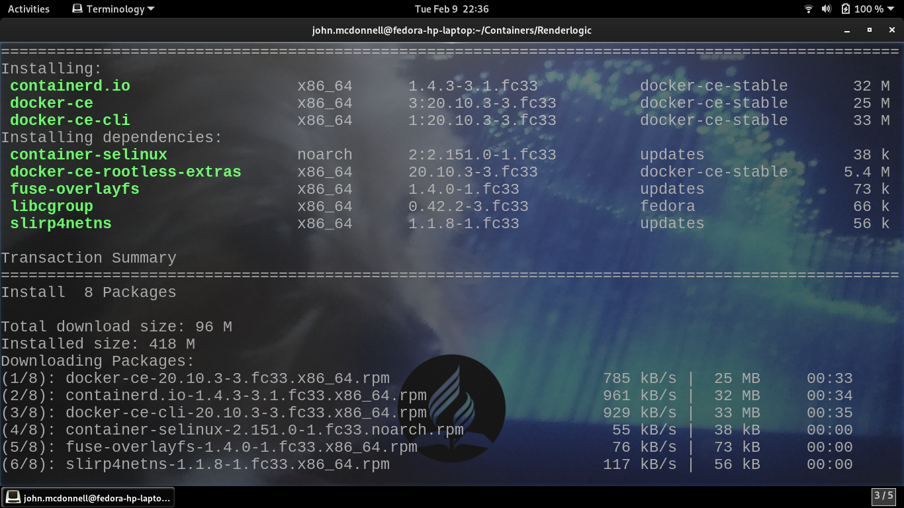
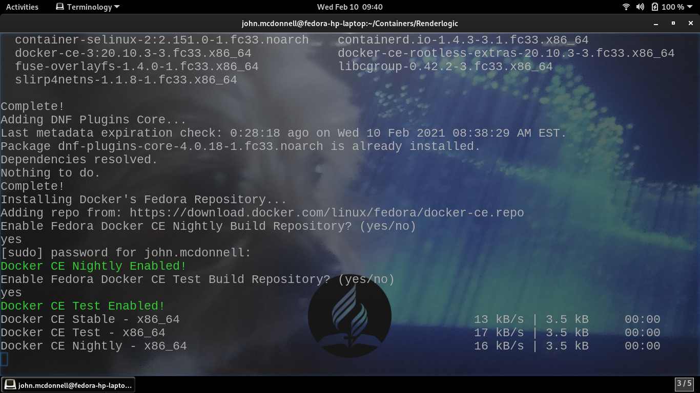
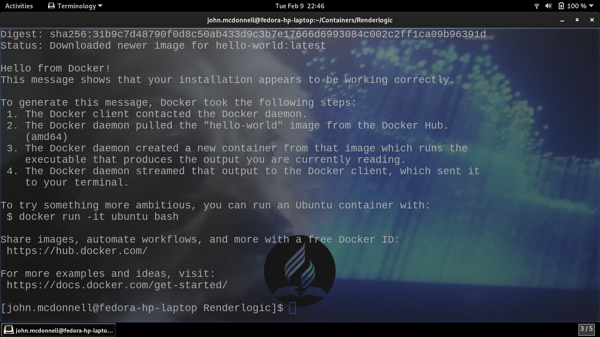
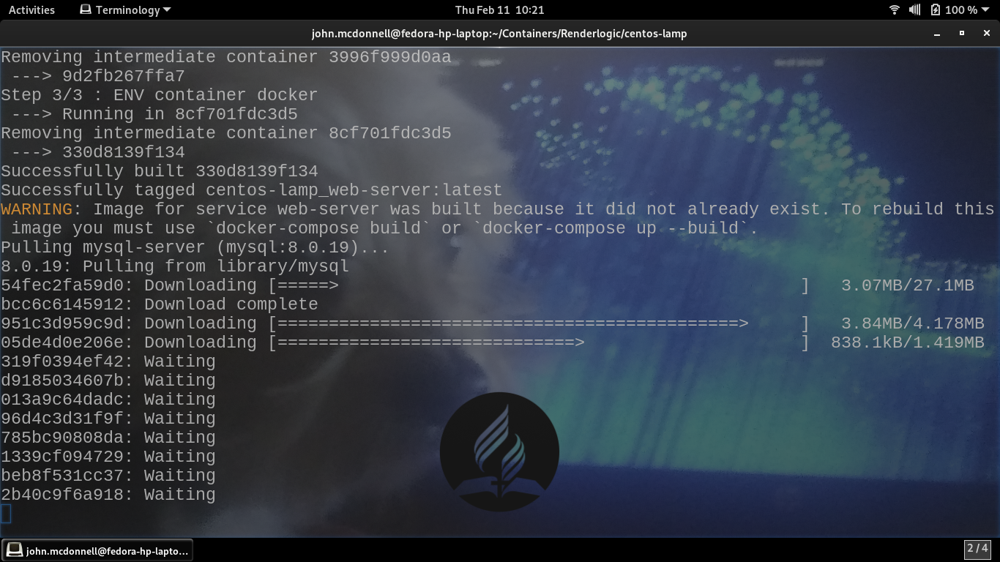

# docker-containers
Free Generalized Docker Containers for Developer Operations Workflows. Check back routinely for new containers.

## docker-fedora-centos
This repo contains everything needed to launch a virtual development environment for web-based 
services that are being deployed from a Fedora Workstation -> CENTOS server. 

The Repository has two standard branches
1. master 
2. develop

### fedora-centos-base
Contains init.sh which gets docker & tools running on the developers fedora workstation. 

#### fedora-centos-base install verification screenshots

##### 1

##### 2

##### 3

##### 4

##### 5

##### 6

##### 7

### centos-lamp
This is a general CLAMP web-server container... To use this enter the following command
from the cento-os directory

`$ docker-compose up -d`

Also ensure to change /websites/:/var/www/html to whatever your local directory structure is.

#### centos-lamp install verification screenshots

